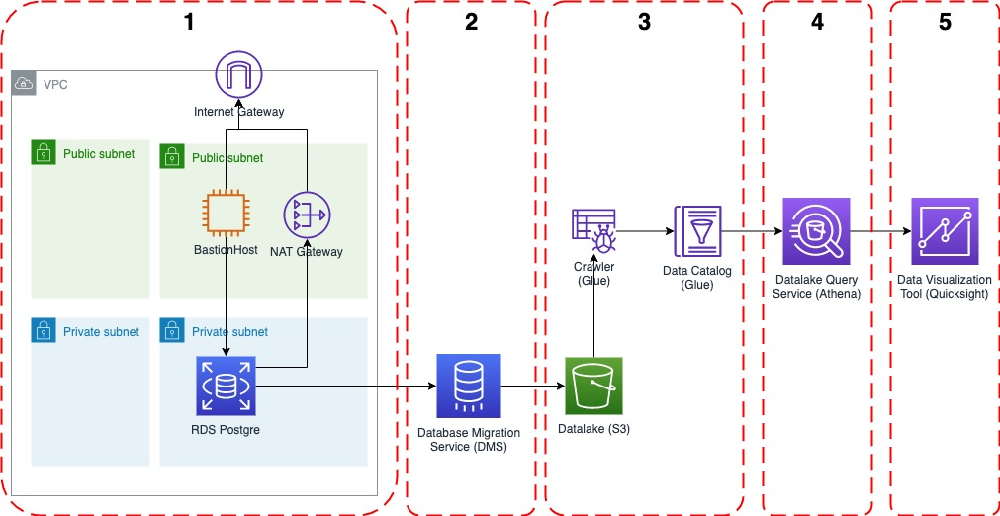

# AWS Data Analytics Postgre Workshop

### Architecture

### Agenda
1. [Setup Database and Datalake](docs/SetupDB.md)
2. [Transfer data from RDS Database Postgre to Datalake S3](docs/TransferDB.md)
3. [Catalog the data with glue crawler and data catalog](docs/Glue.md)
4. [Ad Hoc Query on Datalake with Athena](docs/Athena.md)
5. [Visualize data with Quicksight](docs/Visualize.md)

## Note
* The region will be on ap-southeast-1 (Singapore)
* The instruction is for Mac/Linux user. Please download [PuTTY](https://www.putty.org/) for Windows user.
* In first step, please refer to [this link](https://docs.aws.amazon.com/AWSEC2/latest/UserGuide/putty.html) to connect your EC2 instance