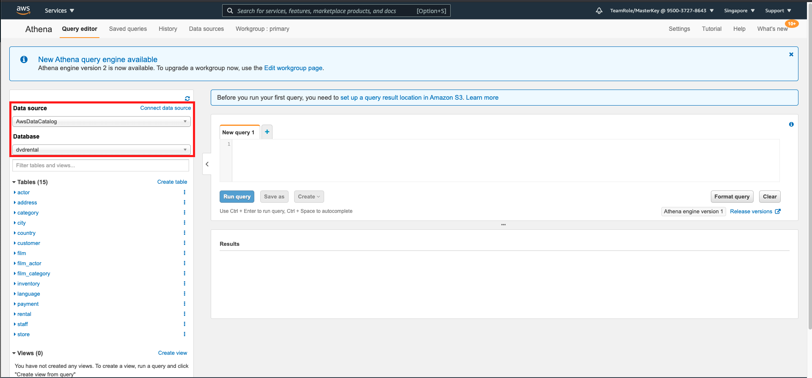
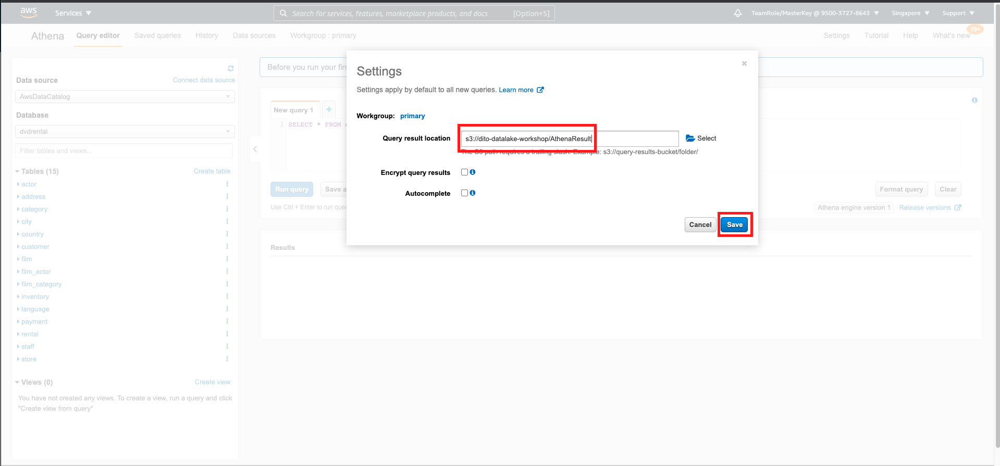

# Ad Hoc Query on Datalake with Athena

We are going to use Ad hoc query service on datalake called Athena. Let's try to use it.
1. Go to [Athena Console](https://ap-southeast-1.console.aws.amazon.com/athena/home?region=ap-southeast-1)
2. click `Get started`

Now, it will display the query page. You can see on the left side, that there is a glue catalog that we have generated by using glue crawler.
    

Before we use it, we need to specify the query result.

3. go to [S3 Console](https://s3.console.aws.amazon.com/s3/home?region=ap-southeast-1)
4. click `create bucket`
5. fill the name with `yourname-athena-result`
6. let the region in `Singapore`
7. click `create bucket`

Now, we can go back to the Athena page.

8. go to [Athena Console](https://ap-southeast-1.console.aws.amazon.com/athena/home?force&region=ap-southeast-1#query)
9. click `Settings` at the top right.
10. click the folder icon, and choose your created bucket named `yourname-athena-result` and click select.
11. click `Save`
    

We can try to do test on the query.

12. Check all customer with the total amount they have spent.
```
SELECT 
cust.customer_id,
CONCAT(cust.first_name, ' ', cust.last_name) AS Full_Name,
SUM(pay.amount) AS Sum_Amount
FROM dvdrental.customer cust
JOIN dvdrental.payment pay ON cust.customer_id = pay.customer_id
GROUP BY cust.customer_id, cust.first_name, cust.last_name
ORDER BY cust.customer_id
```

13. Check most rented film and total of orders
```
SELECT
film.film_id,
film.title,
cat.name,
COUNT(rental.customer_id) AS Total_Order
FROM dvdrental.film film
LEFT JOIN dvdrental.film_category filmcat ON film.film_id = filmcat.film_id
LEFT JOIN dvdrental.category cat ON filmcat.category_id = cat.category_id
LEFT JOIN dvdrental.inventory inv ON film.film_id = inv.film_id
LEFT JOIN dvdrental.rental rental ON inv.inventory_id = rental.inventory_id
GROUP BY film.film_id, film.title, cat.name
ORDER BY Total_Order DESC
LIMIT 10
```

14. Check most city rented a film on
```
SELECT
city.city,
COUNT(cust.customer_id) AS TotalCustomer
FROM dvdrental.city city
LEFT JOIN dvdrental.Address ad ON city.city_id = ad.city_id
LEFT JOIN dvdrental.customer cust ON ad.address_id = cust.address_id
GROUP BY city.city
ORDER BY TotalCustomer DESC
LIMIT 10
```

[BACK TO WORKSHOP GUIDE](../README.md)