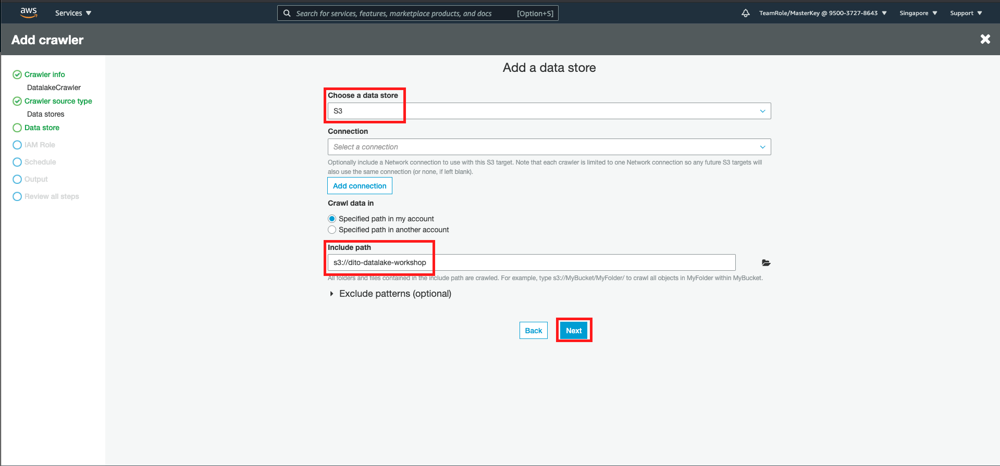
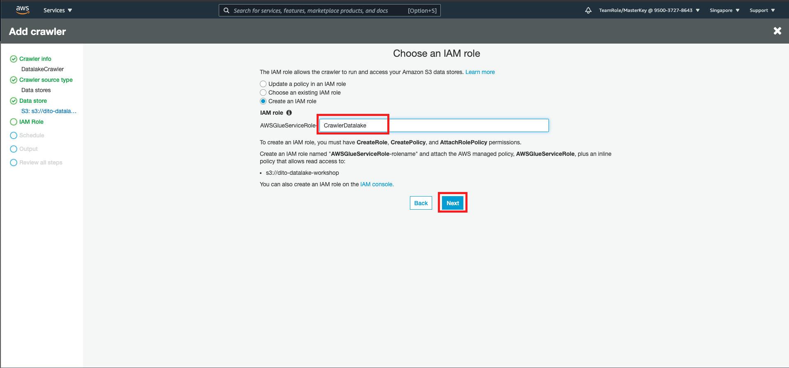
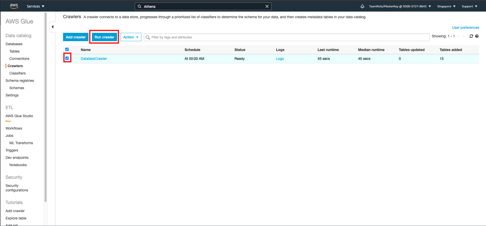
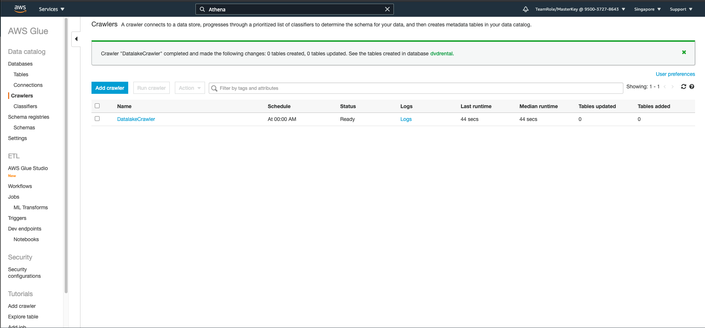
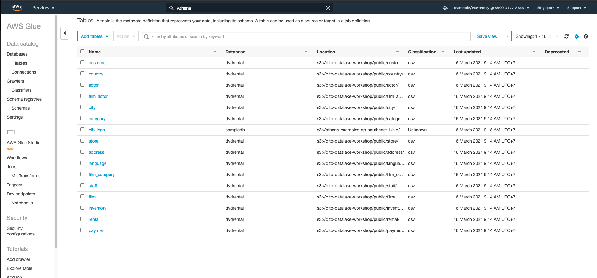

# Catalog the data with glue crawler and data catalog

Now, we are going to use Glue data catalog to act as a metadata and connection between datalake and the ETL service in AWS have.
to detect the datalake, glue will use crawler to crawl and create the metadata.
1. Go to [Glue crawler console](https://ap-southeast-1.console.aws.amazon.com/glue/home?region=ap-southeast-1#catalog:tab=crawlers)
2. in crawler menu, click `Add crawler`
3. in crawler name, fill `DatalakeCrawler`
4. in specify crawler source type, click `next`
5. in add data store page, choose `S3` as data store
6. in include patch, click the folder icon, and choose your datalake location
7. click `next`
    
8. in add another data store, choose `no` and click `next`
9. in IAM role, click `create an IAM role`
10. fill the IAM role name as `CrawlerDatalake`
11. click `next`
    
12. for frequency, choose `daily`
13. in start hour, choose `00` and for start minute, choose `00`
14. click `next`
15. in configure crawler output, click `add database`. Pop up menu will be open
16. in database name, fill `dvdrental` and click create
17. click `next`
18. in review, scroll down and click `finish`

Now, let's try to run the crawler

19. Click the checkbox besides your crawler
20. click `Run Crawler`
    

It will display the running step. Might take around 2 minutes to run.
    

Once it's stop, it will display `Ready` on status.

Let's check the database

21. in left menu, click `Tables` on `Databases`
    

[BACK TO WORKSHOP GUIDE](../README.md)