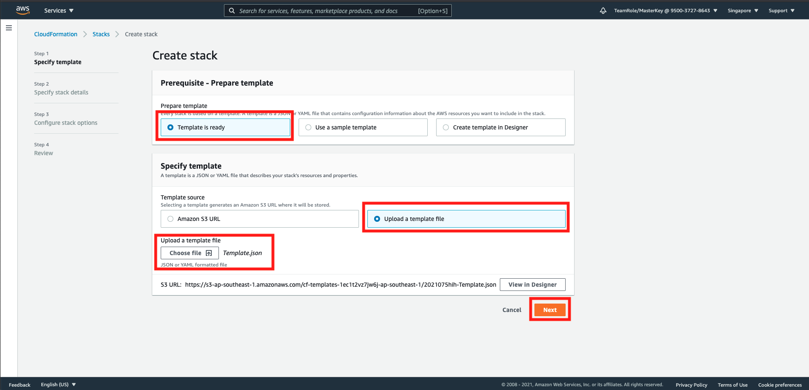
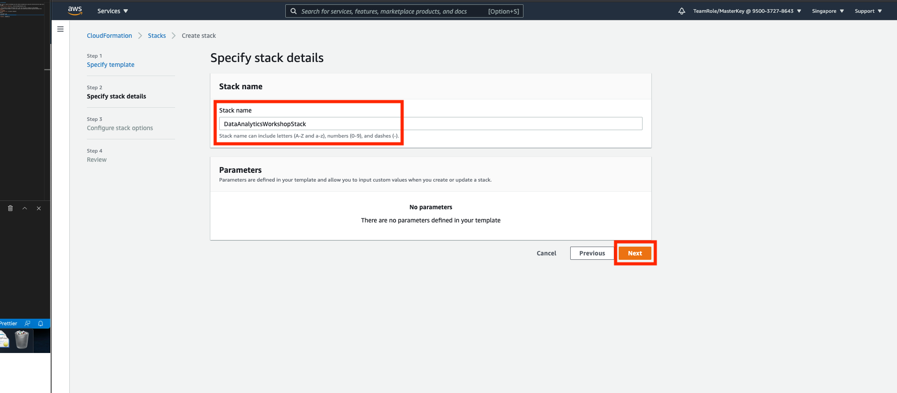
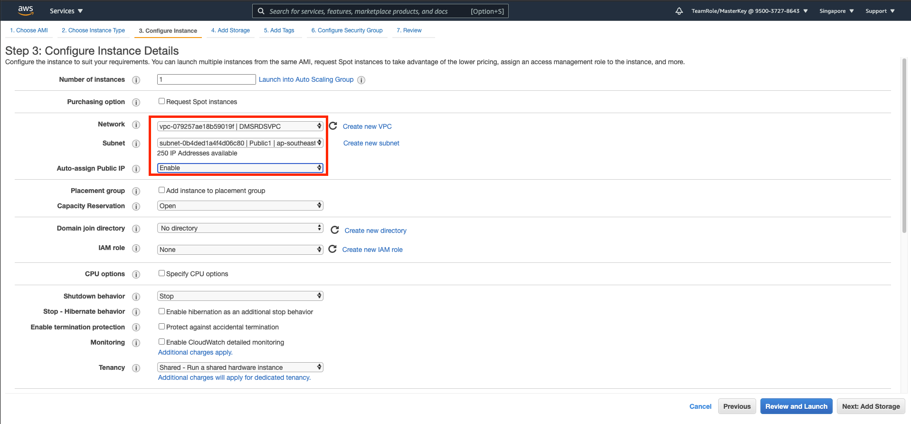
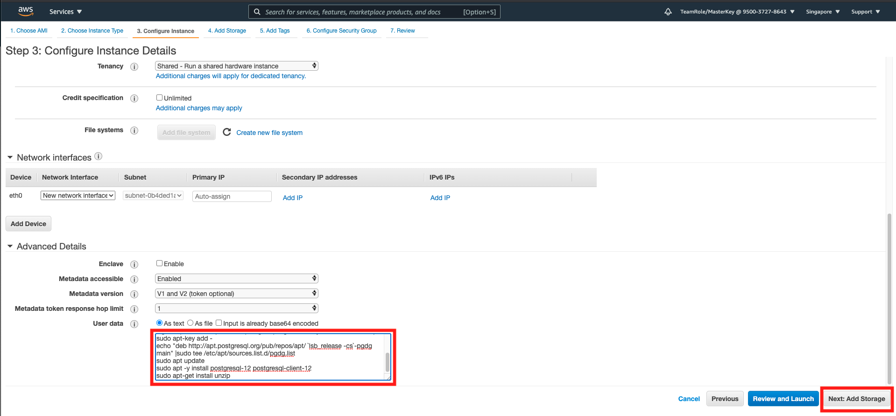
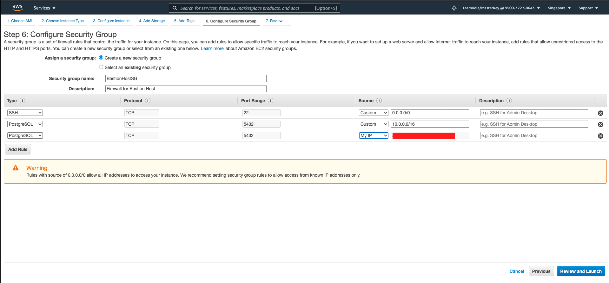
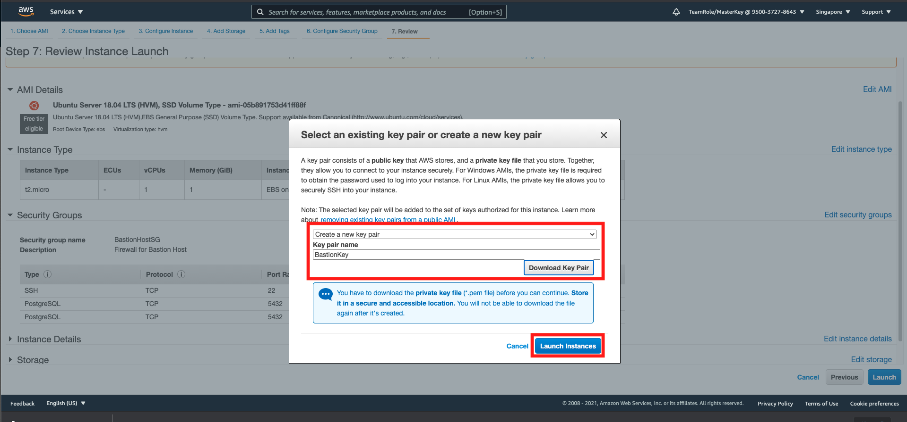
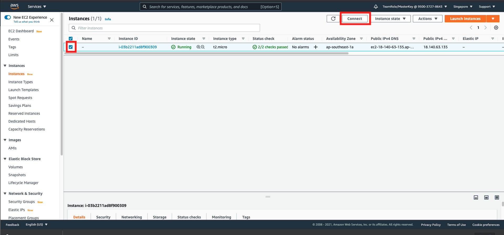
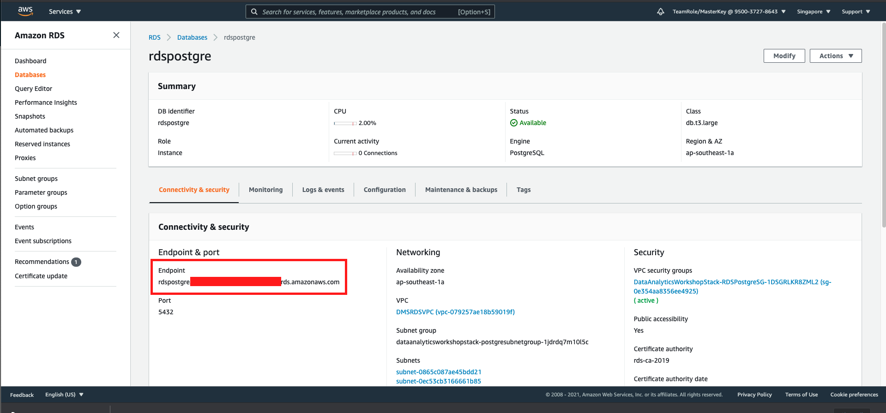
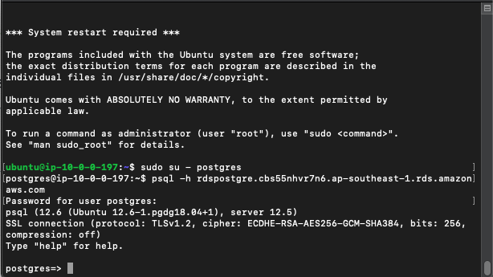
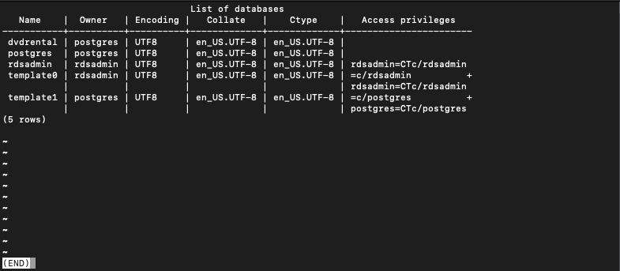

# Setup Database and Datalake

To do the Workshop, we will create the database and the network automatically using the Infrastructure-as-code service, called `CloudFormation` on AWS
1. Download this [Infrastructure Template](../Assets/SetupDB/Template.json)

Then, after that, we are going to setup the Bastion host. This will be used to connect to the database

2. go to [CloudFormation Console](https://ap-southeast-1.console.aws.amazon.com/cloudformation/home?region=ap-southeast-1#/)
3. click `Create Stack`
4. click `Template is Ready`
5. click `Upload a template file` on specify template
6. upload the template
7. click `Next`
    
8. fill the stack name as `DataAnalyticsWorkshopStack`
9. click `Next`
    
10. scroll down and click `Next`
11. scroll down and click `Create Stack`

This will take a while.

Once you are done, we are going to create the EC2, which will act as a bridge to the database.

12. go to [EC2 Console](https://ap-southeast-1.console.aws.amazon.com/ec2/v2/home?region=ap-southeast-1#Instances:)
13. Click `Launch Instances`
14. choose `Ubuntu Server 18.04 LTS (HVM), SSD Volume Type` and click `select`
15. In instance type, choose `t2.micro`, and click `Next: configure instance details`
16. In Instance details, choose the network as `DMSRDSVPC`
17. in subnet, choose `Public1`
18. in Auto-assign Public IP, choose `Enable`
    
19. Scroll down, and open Advanced details
20. in user data, copy this code and paste to the field.
```
#!/bin/bash
sudo apt update 
sudo apt -y install vim bash-completion wget 
sudo apt -y upgrade
wget --quiet -O - https://www.postgresql.org/media/keys/ACCC4CF8.asc | sudo apt-key add -
echo "deb http://apt.postgresql.org/pub/repos/apt/ `lsb_release -cs`-pgdg main" |sudo tee /etc/apt/sources.list.d/pgdg.list
sudo apt update 
sudo apt -y install postgresql-12 postgresql-client-12
sudo apt-get install unzip
```

This code will be used to install the postgre, so we can automatically use it.

21. click `add storage`
    
22. in add storage, click `next:add tags`
23. in add tags, click `next:configure security group`
24. in security group name, type `BastionHostSG`
25. in description, type `Firewall for Bastion Host`
26. click `add rule`
27. in type, click `PostgreSQL`
28. in source, type `10.0.0.0/16` this is the CIDR for the VPC
29. click `add rule`
30. in type, click `PostgreSQL`
31. in source, click the dropdown and choose `My IP`
32. click `review and launch`
    
33. in review page, click `launch`
34. in key options, choose `create a new key pair`
35. fill the name as `BastionKey`
36. click `download key pair`
37. click `launch instances`
    
38. click `view instances`

this will take a while.

During EC2 creation, let's create the datalake

39. go to [S3 Console](https://s3.console.aws.amazon.com/s3/home?region=ap-southeast-1#)
40. click `create bucket`
41. in bucket name, type `yourname-datalake-workshop`
42. in region, choose `Singapore`
43. scroll down and click `Create bucket`

Now, let's go back to your EC2.

44. go to [EC2 Console](https://ap-southeast-1.console.aws.amazon.com/ec2/v2/home?region=ap-southeast-1#Instances:)
45. click your instance and click connect
    
46. go to ssh client
47. open your terminal
48. go to your `BastionKey.pem` file directory
49. type `chmod 400 BastionKey.pem`
50. copy the example ssh cli, and paste it on your terminal. it looks like `ssh -i `BastionKey.pem` ubuntu@ec2-000-000-000-000.ap-southeast-1.compute.amazonaws.com`

you will be connected to your ec2. Now we need to setup our RDS Postgre

51. go to [RDS Console](https://ap-southeast-1.console.aws.amazon.com/rds/home?region=ap-southeast-1#databases:)
52. click `rdspostgre`
53. copy the endpoint of your database. you may paste it on your text editor.
    
54. go back to your terminal
55. type `sudo su - postgres`

it will make you as a postgres user. Now, we can connect to our postgre RDS

56. type `psql -h <your endpoint goes here>`
57. for password, type `master123`

    

you will be connected to your database. Now, we need to turn on the CDC for the postgres for the migration step later.
in the template, there is a modification on `Parameter group` on RDS. These are the list that you need to modify if you provision your database manually:
```
"rds.logical_replication": "1",
"wal_sender_timeout": "0",
"max_wal_senders": "20",
"max_replication_slots": "50",
"shared_preload_libraries": "pglogical"
```

Now, we need to turn on the CDC on RDS.

58. execute this query
```
create extension pglogical;
select * FROM pg_catalog.pg_extension;
```

you will see that there is a pglogical running. Means that we have successfully enabled the CDC.

59. press `q` in keyboard to exit
60. type `\q` to quit postgres
61. type `exit` on postgres user to logout

We are going to take sample data

62. type `wget https://sp.postgresqltutorial.com/wp-content/uploads/2019/05/dvdrental.zip`
63. type `unzip dvdrental.zip`

you will see dvdrental.tar file once you have executed the cli. Now, we are going to do a backup on the RDS. first, copy the file to the postgres user

64. type `sudo su`
65. type `cp dvdrental.tar /var/lib/postgresql/`
66. type `cd /var/lib/postgresql/`
67. type `chown -R postgres dvdrental.tar`
68. type `exit`

Now, login to postgre user to do the backup

69. type `sudo su - postgres`
70. Execute `pg_restore -h <your Endpoint here> -d dvdrental dvdrental.tar`
71. input password as `master123`

Now, let's check the data

72. type `psql -h <your endpoint goes here>`
73. for password, type `master123`

74. in postgre, type `\l`

    

you will see dvdrental database. Now, let's check the data

75. in postgre, type `\c dvdrental`
76. in postgre, type `\dt`

it will display the list of all tables on the database.

Note in the data sample, there are columns that can't be migrated, and thus the data type either need to be changed, or drop the column. In production level case, we suggested to change the data type by using `ALTER TABLE` and see if the data is impacted. For this workshop case, we just need to drop it, for the sake of simplicity.

77. Execute this query
```
ALTER TABLE film
DROP COLUMN fulltext;

ALTER TABLE film
DROP COLUMN special_features;

ALTER TABLE film
DROP COLUMN rating CASCADE;
```

[BACK TO WORKSHOP GUIDE](../README.md)