# Transfer data from RDS Database Postgre to Datalake S3

Now, we are going to use DMS (Database Migration Servivce) as our real-time transfer data tools from our database to our datalake.

First, we need to make the subnet group.

1. Go to [this link](https://ap-southeast-1.console.aws.amazon.com/dms/v2/home?region=ap-southeast-1#firstRun)
2. click `subnet groups`
3. click `create subnet group`
4. in subnet group page, fill the name as `PostgreToS3SG`
5. fill the description as `Subnet group for Postgre to Datalake S3`
6. in VPC, choose `DMSRDSVPC`
7. in add subnet, choose the private subnets (`Private1` and `Private2`)
8. click `Create subnet group`
    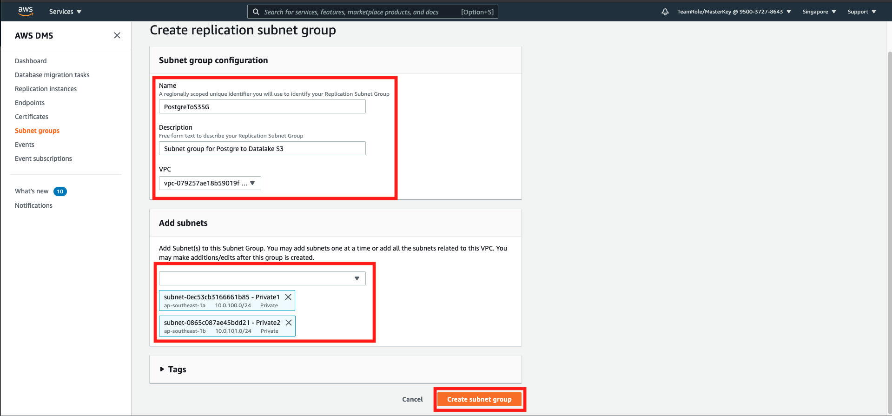

Now, we need to make the replication Instance.

9. in left menu, click `Replication instances`
10. click `Create replication instance`
11. in name, fill `PostgreToS3RI`
12. in description, fill `Instance for replicate Postgre DB to Datalake`
13. in VPC, choose `DMSRDSVPC`
    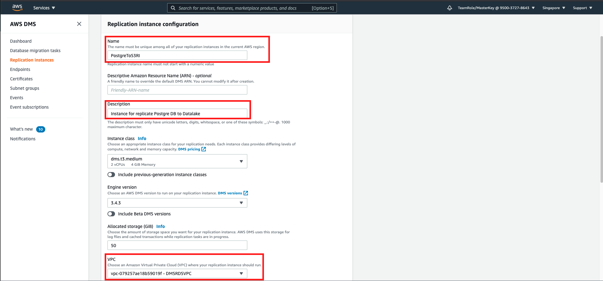
14. scroll down and click `create`

Then, the endpoints, which acts as a connector between the database and data lake. We will make the source endpoint first.
15. click `Endpoints` at the left menu
16. click `create endpoint`
17. select `source endpoint`
18. click `select RDS DB Instance`
19. in RDS instance, fill `rdspostgre`
20. in access to endpoint database, choose `provide access infromation manually`
    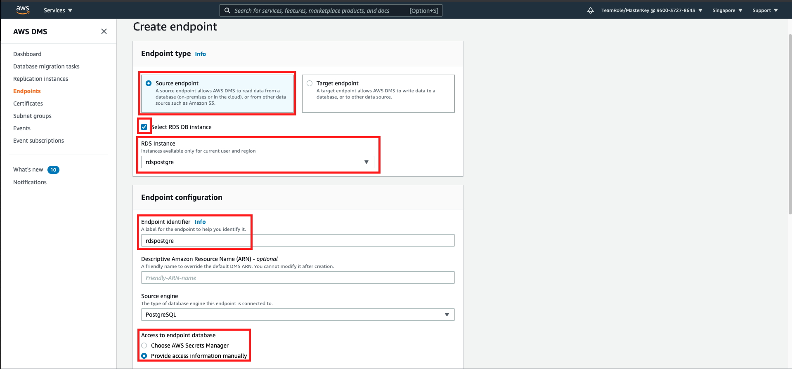
21. fill the password as `master123` in database description
22. open `test endpoint connection` option
23. select VPC as `DMSRDSVPC`
24. for replication instance, choose `postgretos3ri`
25. click `Run test`

you will see the successful connection. 
    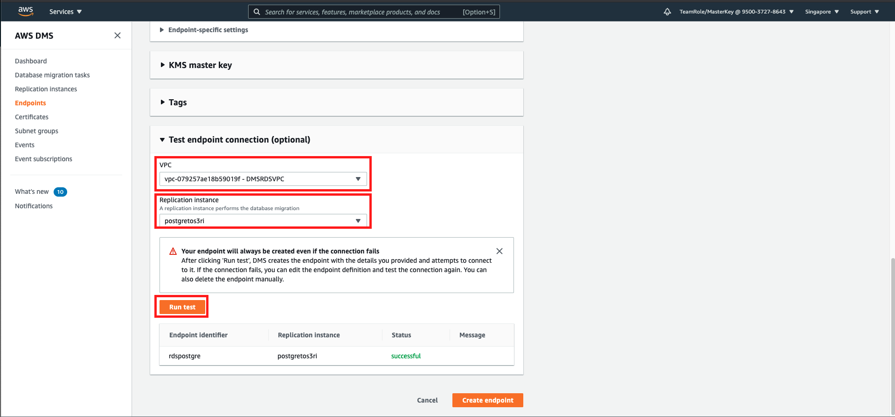

26. click `create endpoint`

Before going to the target endpoint, we need to create the permission to access the data lake.
27. go to [this link](https://console.aws.amazon.com/iam/home?region=ap-southeast-1#/roles)
28. click `Create role`
29. in AWS services, choose `DMS`
30. click `next:permissions`
31. in attach permissions policies, search for `AmazonS3FullAccess`
32. click the checkbox on the left side
33. click `next:tags`
    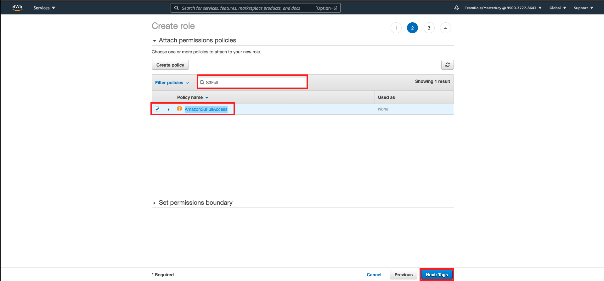
34. click `next:review`
35. in review page, fill the role name as `DMSAccessS3Role`
36. click `create role`
    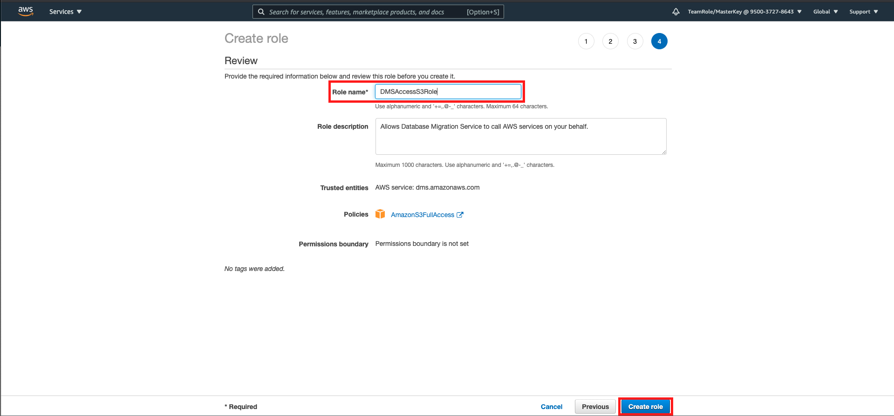
37. In role page on IAM, search the role name of `DMSAccessS3Role` and click the name of the role
    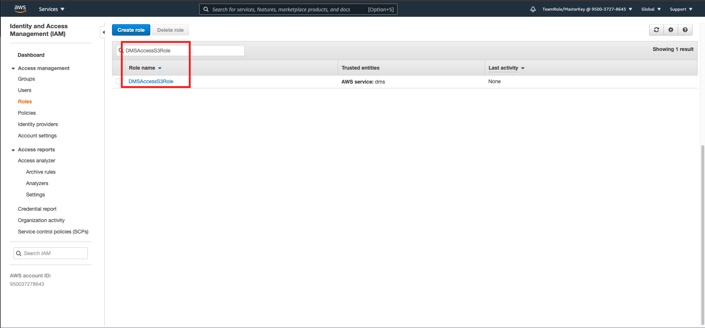
38. copy the Role ARN at the top of the page
    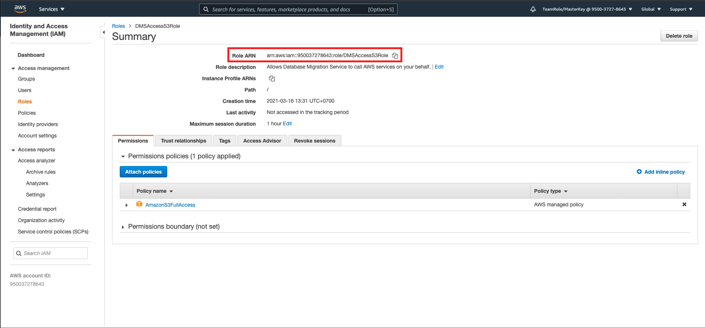

Now, we are going to create the target endpoint
39. go to [this link](https://ap-southeast-1.console.aws.amazon.com/dms/v2/home?region=ap-southeast-1#endpointList)
40. click `Create endpoint` in endpoint homepage
41. click `target endpoint`
42. in endpoint identifier, fill `Datalake`
43. in target engine, choose S3
44. in service access role ARN, fill the Role ARN.
45. in bucket name, fill the bucket name of the data lake we have created.
46. in endpoint-specific settings, fill the extra connection attributes `addColumnName=true`
    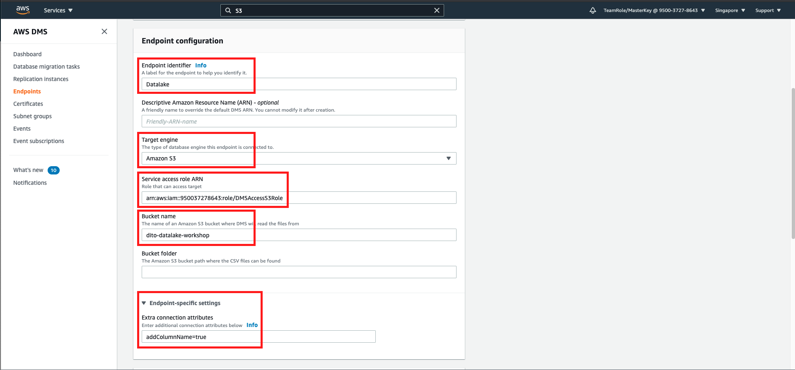
47. open `test endpoint connection` option
48. select VPC as `DMSRDSVPC`
49. for replication instance, choose `postgretos3ri`
50. click `Run test`
    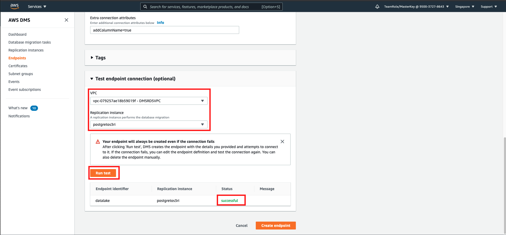

you will see the successful status

51. click `Create Endpoint`

Now, we need to execute the task.

52. click `Database migration tasks` on the left menu
53. click `create task`
54. on task identifier, fill `PostgreRDStoS3Rep`
55. for replication instance, choose `postgretos3ri`
56. in source database endpoint, choose `rdspostgre`
57. in target endpoint, choose `datalake`
58. for migration type, choose `Migrate existing data and replicate ongoing changes`
    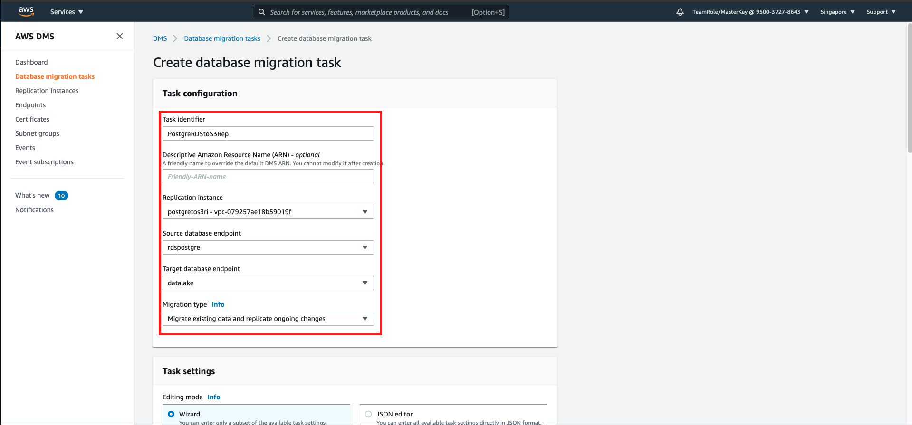
59. in task settings, change the target table preparation mode to `Do nothing`
60. click `Enable CloudWatch logs`
    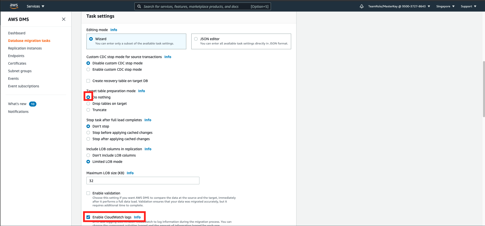
61. in table mappings, click `Add new selection rule`
62. in schema, choose `Enter a schema`
63. in schema name, enter `public`
64. click `create task`
    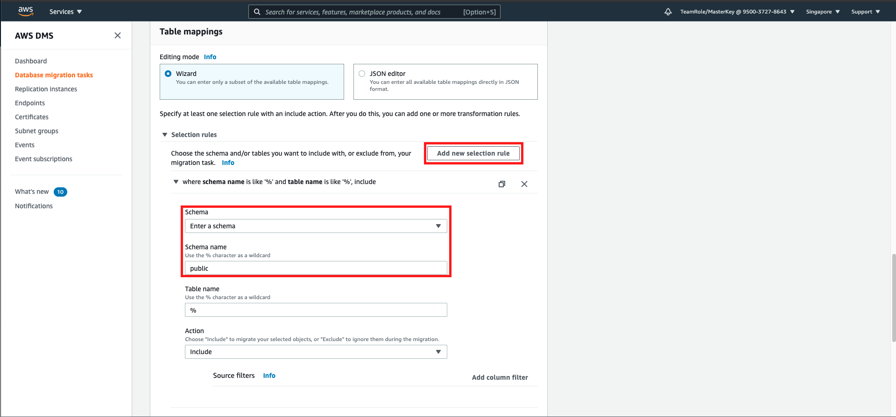

it will take several minutes to complete.
    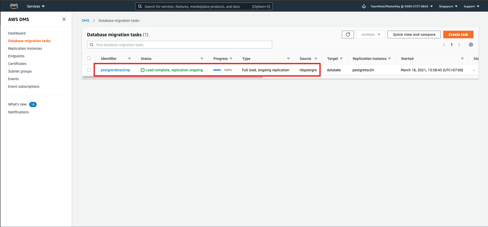

Once it's completed, we need to check the data lake

65. go to [this link](https://s3.console.aws.amazon.com/s3/home?region=ap-southeast-1)
66. click your datalake name `yourname-datalake-workshop`
67. you will see the folder `public` and contains every table inside.
    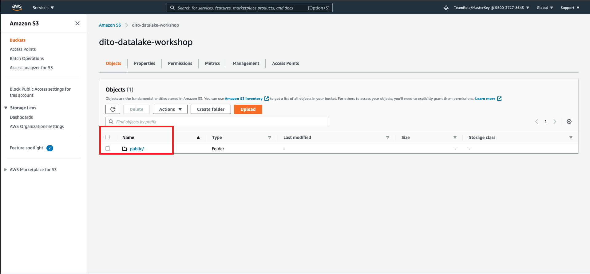

[BACK TO WORKSHOP GUIDE](../README.md)