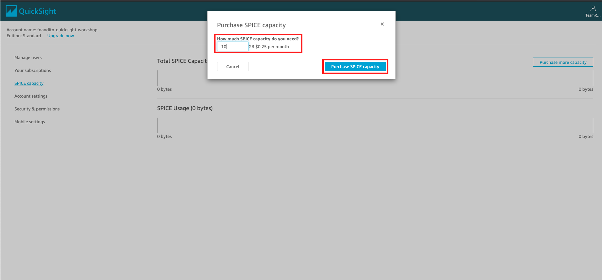
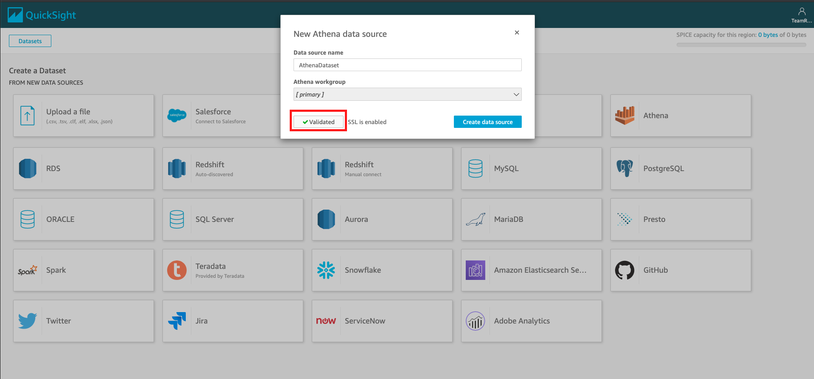
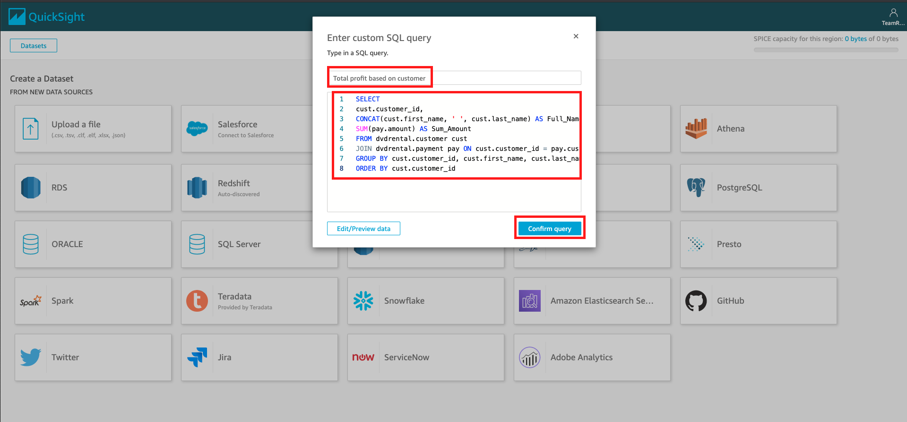
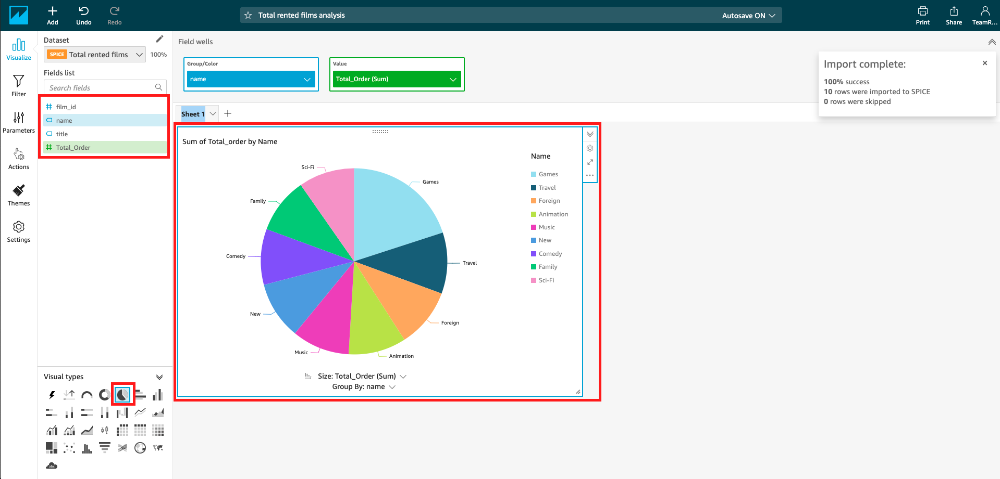
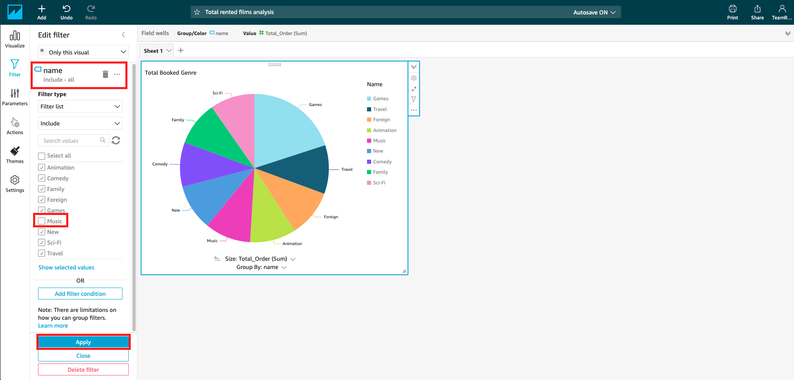
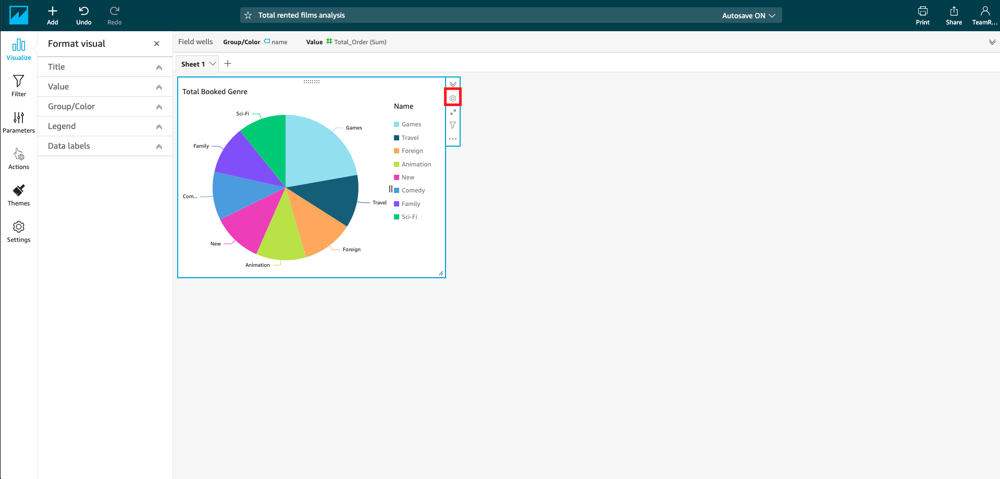
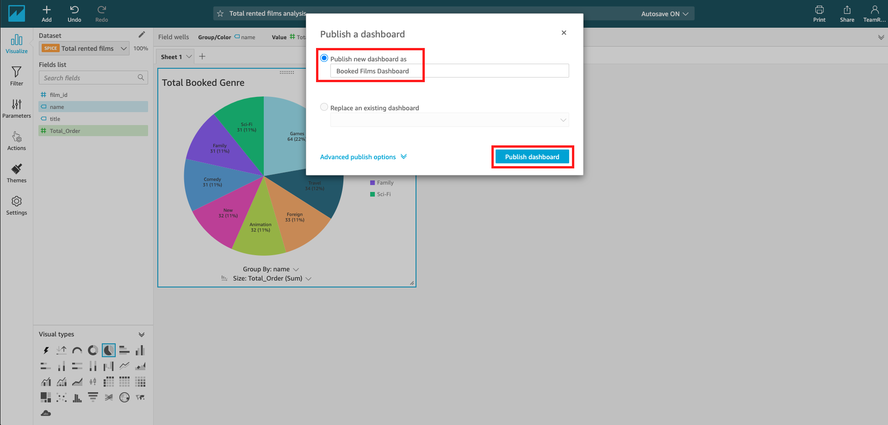
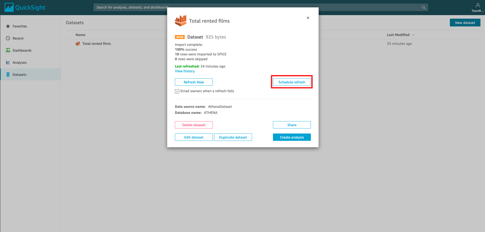
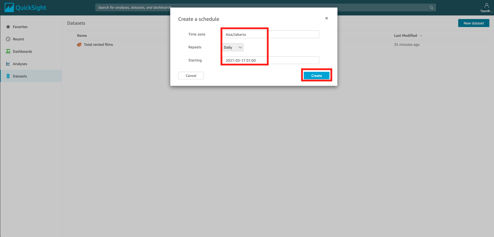

# Visualize data with Quicksight

There is a tool to visualize the data properly on your data lake on AWS, called Quicksight. Now, we are trying to use it.
1. Go to [this link](https://quicksight.aws.amazon.com/sn/start)
2. click "Sign up for QuickSight"
3. Choose "Standard" Edition and click "Continue"
4. select "Singapore" as a region
5. Fill the quicksight account name as "yourname-quicksight-workshop"
6. fill your email address
7. Check "Amazon S3"
8. Select your data lake "yourname-datalake-workshop"
9. click "finish"
10. click "Finish" at the registration page

It will display that you have signed up on quicksight"

11. click "Go to Amazon QuickSight"

We are going to use SPICE as our caching data. Will be convered on the later step. First, let's provision the SPICE capacity.

12. click your account logo on right top, and click "Manage QuickSight"
13. click "SPICE capacity"
14. click "Purchase more capacity"
15. In the capacity, put 10 GB.
16. click "Purchase SPICE capacity"
    
17. click the Quicksight logo on top left.

Now, we are going to create 1 dashboard

18. go to [this link](https://ap-southeast-1.quicksight.aws.amazon.com/sn/start/analyses)
19. click "New Analysis" on Analyses menu
20. click "New Dataset"
21. click "Athena" as dataset
22. in data source name, fill "AthenaDataset"
23. click "Validate connection"
    

Quicksight will try to connect to your athena. it will be displayed as validated

24. click "Create data source"
25. in database, choose "dvdrental"
26. Click "Use Custom SQL"

We are going to try to use the previous SQL we have done on athena workshop.

27. Fill the name as "Total rented films"
28. Copy and paste this SQL query to the query editor:
```
SELECT
film.film_id,
film.title,
cat.name,
COUNT(rental.customer_id) AS Total_Order
FROM dvdrental.film film
LEFT JOIN dvdrental.film_category filmcat ON film.film_id = filmcat.film_id
LEFT JOIN dvdrental.category cat ON filmcat.category_id = cat.category_id
LEFT JOIN dvdrental.inventory inv ON film.film_id = inv.film_id
LEFT JOIN dvdrental.rental rental ON inv.inventory_id = rental.inventory_id
GROUP BY film.film_id, film.title, cat.name
ORDER BY Total_Order DESC
LIMIT 10
```
29. click "Confirm Query"
    
30. in finish dataset creation, choose "Import to SPICE for quicker analytics"
31. click "Visualize"

SPICE is a Storage in quicksight for a faster performance on accessing your data. It acts similarly like caching the data directly to the quicksight.

We are going to make pie chart based on our dataset.

32. In fields list, click "Name" and "Total_Order"
33. in visual types (bottom left), choose "Pie Chart"
    

It will display the pie chart from the data

Let's try to change the title

34. click the title "Sum of Total_order by Name" and erase it
35. change it to "Total Booked Genre"

Let's try to apply a filter. We are going to exclude music.

36. in left menu, click "Filter"
37. click plus sign on the filter menu
38. click "Name"

It will create a name filter

39. click name filter
40. deselect "Music"
41. click "Apply"
    

It will automatically changing the pie chart.

Now, we are going to show the data label.

42. click gear icon on your visual card. It will display the format visual tab.
    
43. on the tab, click "data labels"
44. check the "show metric"
45. change the position to "inside"
46. click "Title"
47. change the title font size to "Extra large"

It will be automatically applied to the dashboard.

Now, let's share the dashboard.

48. click "Share" at the top right
49. click "Publish Dashboard"
50. in the name, fill "Booked Films Dashboard"
51. click "Publish dashboard"
    
52. in share dashboard, you can click "Share with everyone in this account"
53. click "confirm"

you may want to add new users, you can click "Add users" to add more users to share the dashboard.

One last thing. Since we are using SPICE, we need to update the data and schedule the data refresh.

54. on main menu, click "Datasets"
55. click your datasets "Total rented films"
56. Click "Schedule refresh"
    
57. click "create"
58. in schedule refresh, make sure the time zone is "Asia/Jakarta"
59. choose the repeats into "Daily"
60. move the date into 1 day after this workshop session, and change the date into 01:00
61. click "create"
    
62. close the schedule refresh window.

[BACK TO WORKSHOP GUIDE](../README.md)